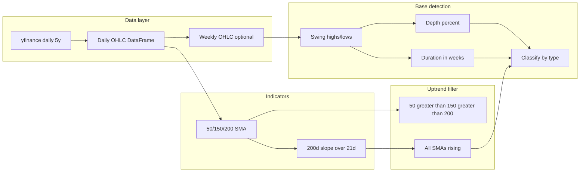

# SEPA Base Detection Implementation

## Scope

- **Uptrend definition**: 200d SMA rising for at least 1 month (longer preferred); 50d > 150d > 200d with all three sloping upward.
- **Base types** (with week ranges and intent):

| Base type            | Duration   | Notes                                               |
| -------------------- | ---------- | --------------------------------------------------- |
| Cup completion cheat | 6–52 weeks | Cup part of cup & handle still forming (early buy). |
| Low cheat            | 6–52 weeks | Same but current price in lower third of cup.       |
| Cup w/ handle        | 7–65 weeks | Full cup + handle.                                  |
| Double bottom        | 7–65 weeks | Two distinct lows (W).                              |
| Darvas box           | 4–6 weeks  | Tight consolidation (clear high/low range).         |
| Power Play           | 2–6 weeks  | Follows 90%+ gain in prior 8 weeks.                |

- **Output (v1)**: Table on SEPA page listing bases: base type, start day, depth (%), duration (weeks). No drawing on the chart yet.

---

## Data and history

- Current SEPA data: `pages/1_specific_entry_point_analysis.py` uses `_load_daily_ohlcv(symbol)` with **2y daily** from yfinance.
- For SEPA we need: 200d SMA + 21-day slope, plus bases up to 65 weeks. That implies at least ~1 year of lead-in + 65 weeks of base ≈ **2.5+ years** of daily data; **3–5 years** is safer for uptrend confirmation and multiple bases.
- **Recommendation**: Add a dedicated data loader that returns a **DataFrame** (not only chart lists): daily OHLC with a proper date index, for a longer period (e.g. 5y). Reuse the same yfinance + MultiIndex/date-column handling as today. Optionally build a **weekly** OHLC series (e.g. last day of week, O/H/L/C from week's first open, max high, min low, last close) so all "weeks" rules are applied on weekly bars.

---

## 1. Data layer

- **Location**: Either extend `pages/1_specific_entry_point_analysis.py` with a cached "analysis" loader, or (preferred) add a small module under `turtle_rpm` used by the page (e.g. `turtle_rpm/sepa_data.py` or `turtle_rpm/price_data.py`).
- **API**: e.g. `get_daily_ohlcv(symbol: str, years: int = 5) -> pd.DataFrame` returning DataFrame with datetime index and columns `Open`, `High`, `Low`, `Close`, `Volume`. Normalize MultiIndex and date column as in current `_load_daily_ohlcv`. Use `@st.cache_data` at call site or inside the loader.
- **Weekly series**: Helper to aggregate daily → weekly (e.g. week ending Friday: open = first open, high = max high, low = min low, close = last close). Return DataFrame with week-end date index. Used for all "weeks" rules and base duration.

---

## 2. Uptrend filter

- **Input**: Daily DataFrame with Close.
- **Compute**: 50-, 150-, 200-day SMAs on Close; 200d SMA slope over the last 21 trading days (e.g. linear regression or (sma_now - sma_21d_ago) / sma_21d_ago).
- **At a given date T** (e.g. base start = week of prior high):
  - 200d SMA at T is rising: slope over [T-21, T] > 0 (or threshold).
  - 50d(T) > 150d(T) > 200d(T).
  - All three SMAs "pointing up": e.g. 50d(T) > 50d(T-5), 150d(T) > 150d(T-5), 200d(T) > 200d(T-5).
- **Output**: Boolean or score per date. Base detection will only consider bases whose start date passes this filter.

---

## 3. Base detection (algorithm outline)

- **Work on weekly bars** so "6–52 weeks" etc. are natural.
- **Identify pullbacks**: e.g. swing high (pivot high over N weeks) → decline → low(s) → possible recovery. For each such pullback, define:
  - **Start date**: first day of the week of the swing high (base start).
  - **Depth**: (high - low) / high * 100, where high = prior high, low = lowest low in the base.
  - **Duration**: from base start to "end" of base (e.g. current week if still in base, or week of breakout / next swing high). Duration in weeks.
- **Classify by duration and shape** (heuristics, no chart drawing):
  - **Power Play**: duration 2–6 weeks and prior 8 weeks had 90%+ gain (from 8-week-ago close to pre-base high). Then apply uptrend filter at base start.
  - **Darvas box**: duration 4–6 weeks; consolidation (e.g. range high-to-low as % of high not too large, or volatility contraction). Uptrend at base start.
  - **Cup completion cheat**: duration 6–52 weeks; single broad low (cup shape: one major trough); "handle" not yet formed (e.g. no second smaller pullback in upper third). Uptrend at base start.
  - **Low cheat**: same as cup completion but "current" price (e.g. latest close in base) lies in lower third of cup range (price ≤ cup_low + (cup_high - cup_low) / 3). Uptrend at base start.
  - **Cup w/ handle**: duration 7–65 weeks; two pullbacks — first larger (cup), second smaller (handle) in upper portion. Uptrend at base start.
  - **Double bottom**: duration 7–65 weeks; two distinct lows at similar levels (e.g. within a few % of each other), W shape. Uptrend at base start.
- **Pivot logic**: Use rolling/local extrema on weekly high/low (e.g. 2–3 weeks left/right for weekly bars) to mark swing highs and swing lows. Then traverse to build candidate bases and measure depth/duration.
- **Overlap**: A given period might match more than one type (e.g. 6-week consolidation could be both "cup completion" and "Darvas"); list each match once or choose one label by priority (e.g. Power Play > Darvas > Cup completion > Low cheat > Cup w/ handle > Double bottom).

---

## 4. Implementation layout

- **New module**: `turtle_rpm/sepa.py` (or split into `turtle_rpm/sepa_data.py` + `turtle_rpm/sepa_bases.py`):
  - `get_daily_ohlcv(symbol, years)` — fetch and normalize daily OHLC (or call from page with cache).
  - `to_weekly(df_daily)` — daily → weekly OHLC.
  - `compute_smas(df, windows=(50, 150, 200))` — add SMA columns.
  - `uptrend_at_date(df_daily, date)` — True if 200d up for 1 month and 50>150>200 all rising.
  - `find_bases(df_weekly, df_daily, ...)` — returns list of dicts: `base_type`, `start_date`, `depth_pct`, `duration_weeks`; optional `end_date`, `prior_high`, `base_low` for future use.
- **Page**: `pages/1_specific_entry_point_analysis.py`:
  - After symbol selection and existing chart, call `get_daily_ohlcv(symbol, years=5)` (or 3); build weekly; run `find_bases(weekly, daily)`.
  - If no bases: short message ("No bases meeting SEPA criteria").
  - If bases: display a table (e.g. `st.dataframe` or `st.table`) with columns: Base type, Start date, Depth (%), Duration (weeks).

---

## 5. Testing and robustness

- **Edge cases**: Insufficient history (< 200 days), missing Volume, all NaN in a window. Guard: require minimum bars (e.g. 252) before running base detection; skip or partial result for short history.
- **Tests**: Unit tests for SMA and uptrend logic (synthetic DataFrame); optional tests for pivot detection and depth/duration on a small weekly series. Integration test with a known symbol (e.g. AAPL) to ensure no crash and sensible-looking output.
- **Caching**: Cache `get_daily_ohlcv` by symbol (and years) so chart and base analysis share the same fetch; cache base results by symbol if desired to avoid recomputation on every rerun.

---

## 6. Out of scope for v1

- Plotting bases on the chart (overlay shapes or annotations).
- Fundamental filters (earnings, relative strength).
- Handle "current" base vs "completed" base (v1 can list all detected bases in the lookback window).

---

## Summary

1. Add a data layer (daily 3–5y DataFrame + weekly aggregation) and keep it in `turtle_rpm` for reuse.
2. Implement 50/150/200 SMA and uptrend check (200d rising ≥1 month, 50>150>200, all rising).
3. Implement base detection on weekly bars: pivot-based pullbacks, depth %, duration in weeks, then classify into the six types by duration and simple shape/location rules.
4. On the SEPA page, run the pipeline when a symbol is selected and display a table of bases (type, start date, depth %, duration). No chart overlay in v1.
